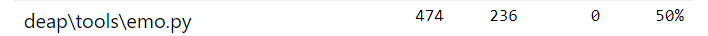
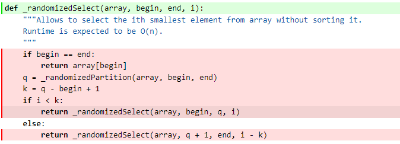

# Report for Assignment 1

## Project chosen

Name: deep-SEP

URL: https://github.com/Eric-Wang-VUA/deap-SEP

Number of lines of code and the tool used to count it: 13228, Lizard

Programming language: Python

## Coverage measurement

### Existing tool

<Inform the name of the existing tool that was executed and how it was executed>
Coverage.py

First we run the command

```shell
coverage run -m pytest
```

Then we run the command

```shell
coverage report
```

And we got the coverage results below:

<Show the coverage results provided by the existing tool with a screenshot>

<div style="text-align: center;">
     
</div>

### Your own coverage tool

**Group member name:**

Dan Zou

**Function 1 name:**

trap

**A patch (diff) shows the instrumented code to gather coverage measurements:**

Original code:

```python
def trap(individual):
    u = sum(individual)
    k = len(individual)
    if u == k:
        return k
    else:
        return k - 1 - u
```

Instrumented code:

```python
branch_coverage_trap = {
    "trap_branch_1": False,  
    "trap_branch_2": False
}

def trap(individual):
    u = sum(individual)
    k = len(individual)
    if u == k:
        branch_coverage_trap["trap_branch_1"] = True
        return k
    else:
        branch_coverage_trap["trap_branch_2"] = True
        return k - 1 - u

def print_coverage_trap():
    for branch, hit in branch_coverage_trap.items():
        print(f"{branch} was {'hit' if hit else 'not hit'}")

```


**A screenshot of the coverage results output by the instrumentation:**

<div style="text-align: center;">
     
</div>
**Function 2 name:**

inv_trap

**A patch (diff) shows the instrumented code to gather coverage measurements:**

Original code:

```python
def inv_trap(individual):
    u = sum(individual)
    k = len(individual)
    if u == 0:
        return k
    else:
        return u - 1
```

Instrumented code:

```python
branch_coverage_inv_trap = {
    "inv_trap_branch_1": False,  
    "inv_trap_branch_2": False
}

def inv_trap(individual):
    u = sum(individual)
    k = len(individual)
    if u == 0:
        branch_coverage_inv_trap["inv_trap_branch_1"] = True
        return k
    else:
        branch_coverage_inv_trap["inv_trap_branch_2"] = True
        return u - 1

def print_coverage_inv_trap():
    for branch, hit in branch_coverage_inv_trap.items():
        print(f"{branch} was {'hit' if hit else 'not hit'}")
```

**A screenshot of the coverage results output by the instrumentation:**

<div style="text-align: center;">
     
</div>


**Group member name:**

Yong Wang

**Function 1 name:**

chuang_f1

**A patch (diff) shows the instrumented code to gather coverage measurements:**

Original code:

```python
def chuang_f1(individual):
    """Binary deceptive function from : Multivariate Multi-Model Approach for
    Globally Multimodal Problems by Chung-Yao Chuang and Wen-Lian Hsu.

    The function takes individual of 40+1 dimensions and has two global optima
    in [1,1,...,1] and [0,0,...,0].
    """
    total = 0
    if individual[-1] == 0:
        for i in range(0, len(individual) - 1, 4):
            total += inv_trap(individual[i:i + 4])
    else:
        for i in range(0, len(individual) - 1, 4):
            total += trap(individual[i:i + 4])
    return total,

```

Instrumented code:

```python
branch_coverage_chuang_f1 = {
    "chuang_f1_branch_1": False,  
    "chuang_f1_branch_2": False
}

branch_coverage_chuang_f1 = {
    "chuang_f1_branch_1": False,  
    "chuang_f1_branch_2": False
}

def chuang_f1(individual):
    """Binary deceptive function from : Multivariate Multi-Model Approach for
    Globally Multimodal Problems by Chung-Yao Chuang and Wen-Lian Hsu.

    The function takes individual of 40+1 dimensions and has two global optima
    in [1,1,...,1] and [0,0,...,0].
    """
    total = 0
    if individual[-1] == 0:
        branch_coverage_chuang_f1["chuang_f1_branch_1"] = True
        for i in range(0, len(individual) - 1, 4):
            total += inv_trap(individual[i:i + 4])
    else:
        branch_coverage_chuang_f1["chuang_f1_branch_2"] = True
        for i in range(0, len(individual) - 1, 4):
            total += trap(individual[i:i + 4])
    return total,

def print_coverage_chuang_f1():
    for branch, hit in branch_coverage_chuang_f1.items():
        print(f"{branch} was {'hit' if hit else 'not hit'}")


def print_coverage_chuang_f1():
    for branch, hit in branch_coverage_chuang_f1.items():
        print(f"{branch} was {'hit' if hit else 'not hit'}")


```


**A screenshot of the coverage results output by the instrumentation:**

<div style="text-align: center;">
     
</div>
**Function 2 name:**

chuang_f3

**A patch (diff) shows the instrumented code to gather coverage measurements:**

Original code:

```python
def chuang_f3(individual):
    """Binary deceptive function from : Multivariate Multi-Model Approach for
    Globally Multimodal Problems by Chung-Yao Chuang and Wen-Lian Hsu.

    The function takes individual of 40+1 dimensions and has two global optima
    in [1,1,...,1] and [0,0,...,0].
    """
    total = 0
    if individual[-1] == 0:
        for i in range(0, len(individual) - 1, 4):
            total += inv_trap(individual[i:i + 4])
    else:
        for i in range(2, len(individual) - 3, 4):
            total += inv_trap(individual[i:i + 4])
        total += trap(individual[-2:] + individual[:2])
    return total,

```

Instrumented code:

```python
branch_coverage_chuang_f3 = {
    "chuang_f3_branch_1": False,  
    "chuang_f3_branch_2": False
}

def chuang_f3(individual):
    """Binary deceptive function from : Multivariate Multi-Model Approach for
    Globally Multimodal Problems by Chung-Yao Chuang and Wen-Lian Hsu.

    The function takes individual of 40+1 dimensions and has two global optima
    in [1,1,...,1] and [0,0,...,0].
    """
    total = 0
    if individual[-1] == 0:
        branch_coverage_chuang_f3["chuang_f3_branch_1"] = True
        for i in range(0, len(individual) - 1, 4):
            total += inv_trap(individual[i:i + 4])
    else:
        branch_coverage_chuang_f3["chuang_f3_branch_2"] = True
        for i in range(2, len(individual) - 3, 4):
            total += inv_trap(individual[i:i + 4])
        total += trap(individual[-2:] + individual[:2])
    return total,

def print_coverage_chuang_f3():
    for branch, hit in branch_coverage_chuang_f3.items():
        print(f"{branch} was {'hit' if hit else 'not hit'}")

```

**A screenshot of the coverage results output by the instrumentation:**

<div style="text-align: center;">
     
</div>


**Group member name:**

Haojia Lu

**Function 1 name:**

selNSGA2

**A patch (diff) shows the instrumented code to gather coverage measurements:**

Original code:

```python
def selNSGA2(individuals, k, nd='standard'):
    """Apply NSGA-II selection operator on the *individuals*. Usually, the
    size of *individuals* will be larger than *k* because any individual
    present in *individuals* will appear in the returned list at most once.
    Having the size of *individuals* equals to *k* will have no effect other
    than sorting the population according to their front rank. The
    list returned contains references to the input *individuals*. For more
    details on the NSGA-II operator see [Deb2002]_.

    :param individuals: A list of individuals to select from.
    :param k: The number of individuals to select.
    :param nd: Specify the non-dominated algorithm to use: 'standard' or 'log'.
    :returns: A list of selected individuals.

    .. [Deb2002] Deb, Pratab, Agarwal, and Meyarivan, "A fast elitist
       non-dominated sorting genetic algorithm for multi-objective
       optimization: NSGA-II", 2002.
    """
    if nd == 'standard':
        pareto_fronts = sortNondominated(individuals, k)
    elif nd == 'log':
        pareto_fronts = sortLogNondominated(individuals, k)
    else:
        try:
            raise Exception('selNSGA2: The choice of non-dominated sorting '
                        'method "{0}" is invalid.'.format(nd))
        except:
            return 0

    for front in pareto_fronts:
        assignCrowdingDist(front)

    chosen = list(chain(*pareto_fronts[:-1]))
    k = k - len(chosen)
    if k > 0:
        sorted_front = sorted(pareto_fronts[-1], key=attrgetter("fitness.crowding_dist"), reverse=True)
        chosen.extend(sorted_front[:k])

    return chosen

```

Instrumented code:

```python
selNSGA2_branches = [False, False, False, False, False]


def selNSGA2(individuals, k, nd='standard'):
    """Apply NSGA-II selection operator on the *individuals*. Usually, the
    size of *individuals* will be larger than *k* because any individual
    present in *individuals* will appear in the returned list at most once.
    Having the size of *individuals* equals to *k* will have no effect other
    than sorting the population according to their front rank. The
    list returned contains references to the input *individuals*. For more
    details on the NSGA-II operator see [Deb2002]_.

    :param individuals: A list of individuals to select from.
    :param k: The number of individuals to select.
    :param nd: Specify the non-dominated algorithm to use: 'standard' or 'log'.
    :returns: A list of selected individuals.

    .. [Deb2002] Deb, Pratab, Agarwal, and Meyarivan, "A fast elitist
       non-dominated sorting genetic algorithm for multi-objective
       optimization: NSGA-II", 2002.
    """
    if nd == 'standard':
        pareto_fronts = sortNondominated(individuals, k)
        selNSGA2_branches[0] = True
    elif nd == 'log':
        pareto_fronts = sortLogNondominated(individuals, k)
        selNSGA2_branches[1] = True
    else:
        selNSGA2_branches[2] = True
        try:
            raise Exception('selNSGA2: The choice of non-dominated sorting '
                        'method "{0}" is invalid.'.format(nd))
        except:
            return 0

    for front in pareto_fronts:
        assignCrowdingDist(front)

    chosen = list(chain(*pareto_fronts[:-1]))
    k = k - len(chosen)
    if k > 0:
        selNSGA2_branches[3] = True
        sorted_front = sorted(pareto_fronts[-1], key=attrgetter("fitness.crowding_dist"), reverse=True)
        chosen.extend(sorted_front[:k])
    else:
        selNSGA2_branches[4] = True

    return chosen


def print_selNSGA2Coverage():
    count = 0
    for item in selNSGA2_branches:
        if item:
            count += 1
    coverage = (count / 5) * 100
    print("The branch coverage of the function \"selNSHA2\" is ", coverage, "%.")

```


**A screenshot of the coverage results output by the instrumentation:**

<div style="text-align: center;">
     
</div>
**Function 2 name:**

_randomizedSelect

**A patch (diff) shows the instrumented code to gather coverage measurements:**

Original code:

```python
def _randomizedSelect(array, begin, end, i):
    """Allows to select the ith smallest element from array without sorting it.
    Runtime is expected to be O(n).
    """
    if begin == end:
        return array[begin]
   
    q = _randomizedPartition(array, begin, end)
    k = q - begin + 1
    if i < k:
        return _randomizedSelect(array, begin, q, i)
    else:
        return _randomizedSelect(array, q + 1, end, i - k)

```

Instrumented code:

```python
randomizedSelect_branches = [False, False, False, False]


def _randomizedSelect(array, begin, end, i):
    """Allows to select the ith smallest element from array without sorting it.
    Runtime is expected to be O(n).
    """
    if begin == end:
        randomizedSelect_branches[0] = True
        return array[begin]
    else:
        randomizedSelect_branches[1] = True
        
    q = _randomizedPartition(array, begin, end)
    k = q - begin + 1
    if i < k:
        randomizedSelect_branches[2] = True
        return _randomizedSelect(array, begin, q, i)
    else:
        randomizedSelect_branches[3] = True
        return _randomizedSelect(array, q + 1, end, i - k)


def print_randomizedSelectCoverage():
    count = 0
    for item in randomizedSelect_branches:
        if item:
            count += 1
    coverage = (count / 4) * 100
    print("The branch coverage of the function \"_randomizedSelect\" is ", coverage, "%.")
```

**A screenshot of the coverage results output by the instrumentation:**

<div style="text-align: center;">
     
</div>


**Group member name:**

Xuzhan Du

**Function 1 name:**

chuang_f2

**A patch (diff) shows the instrumented code to gather coverage measurements:**

Original code:

```python
def chuang_f2(individual):
    """Binary deceptive function from : Multivariate Multi-Model Approach for
    Globally Multimodal Problems by Chung-Yao Chuang and Wen-Lian Hsu.

    The function takes individual of 40+1 dimensions and has four global optima
    in [1,1,...,0,0], [0,0,...,1,1], [1,1,...,1] and [0,0,...,0].
    """
    total = 0
    if individual[-2] == 0 and individual[-1] == 0:
        for i in range(0, len(individual) - 2, 8):
            total += inv_trap(individual[i:i + 4]) + inv_trap(individual[i + 4:i + 8])
    elif individual[-2] == 0 and individual[-1] == 1:
        for i in range(0, len(individual) - 2, 8):
            total += inv_trap(individual[i:i + 4]) + trap(individual[i + 4:i + 8])
    elif individual[-2] == 1 and individual[-1] == 0:
        for i in range(0, len(individual) - 2, 8):
            total += trap(individual[i:i + 4]) + inv_trap(individual[i + 4:i + 8])
    else:
        for i in range(0, len(individual) - 2, 8):
            total += trap(individual[i:i + 4]) + trap(individual[i + 4:i + 8])
    return total,

```

Instrumented code:

```python
chuang_f2_branch = [False, False, False, False]

def chuang_f2(individual):
    """Binary deceptive function from : Multivariate Multi-Model Approach for
    Globally Multimodal Problems by Chung-Yao Chuang and Wen-Lian Hsu.

    The function takes individual of 40+1 dimensions and has four global optima
    in [1,1,...,0,0], [0,0,...,1,1], [1,1,...,1] and [0,0,...,0].
    """
    total = 0
    if individual[-2] == 0 and individual[-1] == 0:
        chuang_f2_branch[0] = True 
        for i in range(0, len(individual) - 2, 8):
            total += inv_trap(individual[i:i + 4]) + inv_trap(individual[i + 4:i + 8])
    elif individual[-2] == 0 and individual[-1] == 1:
        chuang_f2_branch[1] = True 
        for i in range(0, len(individual) - 2, 8):
            total += inv_trap(individual[i:i + 4]) + trap(individual[i + 4:i + 8])
    elif individual[-2] == 1 and individual[-1] == 0:
        chuang_f2_branch[2] = True 
        for i in range(0, len(individual) - 2, 8):
            total += trap(individual[i:i + 4]) + inv_trap(individual[i + 4:i + 8])
    else:
        chuang_f2_branch[3] = True 
        for i in range(0, len(individual) - 2, 8):
            total += trap(individual[i:i + 4]) + trap(individual[i + 4:i + 8])
    return total,

def print_chuang_f2_coverage():    
    count = 0    
    for i in chuang_f2_branch:        
        if i:            
            count += 1    
    coverage = 100 * (count / 4)    
    print("coverage of the function chuang_f2 ", coverage, "%")

```


**A screenshot of the coverage results output by the instrumentation:**

<div style="text-align: center;">
     
</div>
**Function 2 name:**

isDominated

**A patch (diff) shows the instrumented code to gather coverage measurements:**

Original code:

```python
def isDominated(wvalues1, wvalues2):
    """Returns whether or not *wvalues2* dominates *wvalues1*.

    :param wvalues1: The weighted fitness values that would be dominated.
    :param wvalues2: The weighted fitness values of the dominant.
    :returns: :obj:`True` if wvalues2 dominates wvalues1, :obj:`False`
              otherwise.
    """
    not_equal = False
    for self_wvalue, other_wvalue in zip(wvalues1, wvalues2):
        if self_wvalue > other_wvalue:
            return False
        elif self_wvalue < other_wvalue:
            not_equal = True
    return not_equal

```

Instrumented code:

```python
isDominated_branch = [False, False]

def isDominated(wvalues1, wvalues2):
    """Returns whether or not *wvalues2* dominates *wvalues1*.

    :param wvalues1: The weighted fitness values that would be dominated.
    :param wvalues2: The weighted fitness values of the dominant.
    :returns: :obj:`True` if wvalues2 dominates wvalues1, :obj:`False`
              otherwise.
    """
    not_equal = False
    for self_wvalue, other_wvalue in zip(wvalues1, wvalues2):
        if self_wvalue > other_wvalue:
            isDominated_branch[0] = True
            return False
        elif self_wvalue < other_wvalue:
            isDominated_branch[1] = True
            not_equal = True
    return not_equal

def print_isDominated():    
    count = 0    
    for i in isDominated_branch:        
        if i:            
            count += 1    
    coverage = 100 * (count / 2)    
    print("coverage of the function isDominated ", coverage, "%")
```

**A screenshot of the coverage results output by the instrumentation:**

<div style="text-align: center;">
     
</div>


## Coverage improvement

### Individual tests


**Group member name:**

Dan Zou

**Test 1:**

**A patch (diff) shows enhanced test:**


```python
def test_trap_function(self):
        
        individual_all_ones = [1] * 10
        fitness_all_ones = binary.trap(individual_all_ones)
        self.assertEqual(fitness_all_ones, 10)

        individual_mixed = [1, 0, 1, 0, 1, 1, 0, 0, 1, 0]
        fitness_mixed = binary.trap(individual_mixed)
        self.assertEqual(fitness_mixed, 4)

        individual_all_zeros = [0] * 10
        fitness_all_zeros = binary.trap(individual_all_zeros)
        self.assertEqual(fitness_all_zeros, 9)

```


**A screenshot of the old coverage results:**

<div style="text-align: center;">
     
</div>

<div style="text-align: center;">
     
</div>

**A screenshot of the new coverage results:**


<div style="text-align: center;">
     
</div>

<div style="text-align: center;">
     
</div>
**The coverage improvement is 6%**
**The coverage is improved because we wrote a new test function for function trap, which had not been tested before.**

**Test 2:**


**A patch (diff) shows enhanced test:**


```python
branch_coverage_inv_trap = {
    "inv_trap_branch_1": False,  
    "inv_trap_branch_2": False
}

def inv_trap(individual):
    u = sum(individual)
    k = len(individual)
    if u == 0:
        branch_coverage_inv_trap["inv_trap_branch_1"] = True
        return k
    else:
        branch_coverage_inv_trap["inv_trap_branch_2"] = True
        return u - 1

def print_coverage_inv_trap():
    for branch, hit in branch_coverage_inv_trap.items():
        print(f"{branch} was {'hit' if hit else 'not hit'}")
```

**A screenshot of the old coverage results:**

<div style="text-align: center;">
     
</div>

<div style="text-align: center;">
     
</div>

**A screenshot of the new coverage results:**


<div style="text-align: center;">
     
</div>

<div style="text-align: center;">
     
</div>
**The coverage improvement is 6%**
**The coverage is improved because we wrote a new test function for function inv_trap, which had not been tested before.**


**Group member name:**

Yong Wang

**Test 1:**

**A patch (diff) shows enhanced test:**


```python
def test_chuang_f1_function(self):

        individual_case1 = [1, 1, 1, 1, 1, 1, 1, 1, 1, 1, 1, 1, 1, 1, 1, 1, 1, 1, 1, 1, 1, 1, 1, 1, 1, 1, 1, 1, 1, 1, 1, 1, 1, 1, 1, 1, 1, 1, 1, 1, 0]
        fitness_case1 = binary.chuang_f1(individual_case1)
        self.assertEqual(fitness_case1[0], 30)

        individual_case2 = [0, 0, 0, 0, 0, 0, 0, 0, 0, 0, 0, 0, 0, 0, 0, 0, 0, 0, 0, 0, 0, 0, 0, 0, 0, 0, 0, 0, 0, 0, 0, 0, 0, 0, 0, 0, 0, 0, 0, 0, 1]
        fitness_case2 = binary.chuang_f1(individual_case2)
        self.assertEqual(fitness_case2[0], 30)

```


**A screenshot of the old coverage results:**

<div style="text-align: center;">
     
</div>

<div style="text-align: center;">
     
</div>

**A screenshot of the new coverage results:**


<div style="text-align: center;">
     
</div>

<div style="text-align: center;">
     
</div>
**The coverage improvement is 8%**
**The coverage is improved because we wrote a new test function for function chuang_f1, which had not been tested before.**

**Test 2:**


**A patch (diff) shows enhanced test:**


```python
 def test_chuang_f3_function(self):
        
        individual_case1 = [1] * 41
        fitness_case1 = binary.chuang_f3(individual_case1)
        self.assertEqual(fitness_case1[0], 31)

        individual_case2 = [0] * 41
        fitness_case2 = binary.chuang_f3(individual_case2)
        self.assertEqual(fitness_case2[0], 40)
```

**A screenshot of the old coverage results:**

<div style="text-align: center;">
     
</div>

<div style="text-align: center;">
     
</div>

**A screenshot of the new coverage results:**


<div style="text-align: center;">
     
</div>

<div style="text-align: center;">
     
</div>
**The coverage improvement is 10%**
**The coverage is improved because we wrote a new test function for function chuang_f3, which had not been tested before.**


**Group member name:**

Haojia Lu

**Test 1:**

**A patch (diff) shows enhanced test:**


```python
def test_selNSGA2(self):
        individual = []
        assert(emo.selNSGA2(individual, 0) == [])
        assert(emo.selNSGA2(individual, 5) == [])
        assert(emo.selNSGA2(individual, 0, "log") == [])
        assert(emo.selNSGA2(individual, 0, "else") == 0)

```


**A screenshot of the old coverage results:**

<div style="text-align: center;">
     
</div>

<div style="text-align: center;">
     
</div>

**A screenshot of the new coverage results:**


<div style="text-align: center;">
     
</div>

<div style="text-align: center;">
     
</div>
**The coverage improvement is 0%**
**The coverage is improved because we wrote a new test function for function selNSGA2, which had not been tested before.**

**Test 2:**

**A patch (diff) shows enhanced test:**


```python
 def test_randomselect(self):
        array = [5, 6, 8, 9, 19, 21]
        assert(emo._randomizedSelect(array, 0, 0, 1) == 5)
        assert(emo._randomizedSelect(array, 0, 5, 1) == 6)
```

**A screenshot of the old coverage results:**

<div style="text-align: center;">
     
</div>

<div style="text-align: center;">
     
</div>

**A screenshot of the new coverage results:**


<div style="text-align: center;">
     
</div>

<div style="text-align: center;">
     
</div>
**The coverage improvement is 6%**
**The coverage is improved because we wrote a new test function for function randomselect, which had not been tested before.**


**Group member name:**

Xuzhan Du

**Test 1:**

**A patch (diff) shows enhanced test:**


```python
 def test_selChuangF2(self):    
        binary.chuang_f2([1, 2, 3])    
        binary.chuang_f2([0, 0, 0])    
        binary.chuang_f2([0, 1, 0])    
        binary.chuang_f2([0, 0, 1])

```


**A screenshot of the old coverage results:**

<div style="text-align: center;">
     
</div>

<div style="text-align: center;">
     
</div>

**A screenshot of the new coverage results:**


<div style="text-align: center;">
     
</div>

<div style="text-align: center;">
     
</div>
**The coverage improvement is 15%**
**The coverage is improved because we wrote a new test function for function chuang_f2, which had not been tested before.**

**Test 2:**

**A patch (diff) shows enhanced test:**


```python
def test_selIsDominate(self):    
        wvalues1 = [3, 2, 5]    
        wvalues2 = [2, 2, 6]    
        assert emo.isDominated(wvalues1, wvalues2) == False
        wvalues1 = [3, 2, 5]    
        wvalues2 = [3, 3, 6]    
        assert emo.isDominated(wvalues1, wvalues2) == True
```

**A screenshot of the old coverage results:**

<div style="text-align: center;">
     
</div>

<div style="text-align: center;">
     
</div>

**A screenshot of the new coverage results:**


<div style="text-align: center;">
     
</div>

<div style="text-align: center;">
     
</div>
**The coverage improvement is 1%**
**The coverage is improved because we wrote a new test function for function isDominated, which had not been tested before.**


### Overall

**A screenshot of the old coverage results by running an existing tool:**

<div style="text-align: center;">
     
</div>

**A screenshot of the new coverage results by running the existing tool using all test modifications made by the group:**

<div style="text-align: center;">
     
</div>

## Statement of individual contributions

**Dan Zou developed a test for function trap and a test fpr function inv_trap.
Yong Wang developed a test for function chuang_f1 and a test fpr function chuang_f3.
Haojia Lu developed a test for function selNSGA2 and a test fpr function randomselect.
Xuzhan Du developed a test for function chuang_f2 and a test fpr function isDominated.**
